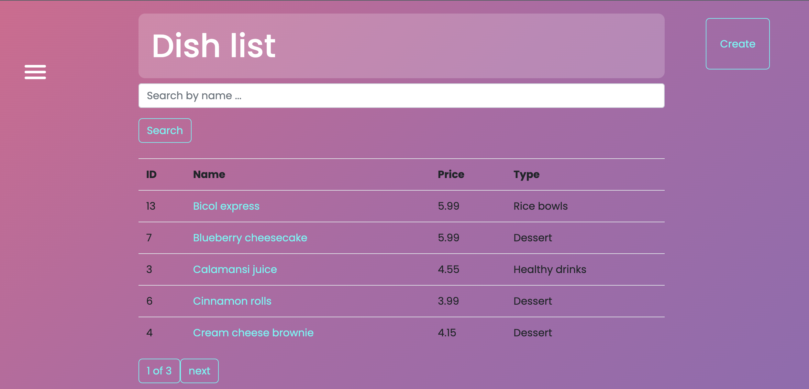

# This is kitchen

The most important aspect of a professional kitchen is discipline. 
This Django project is designed to optimize the functioning 
of this complex mechanism, facilitating communication between chefs and management.

## Project deployed  to Render: https://this-is-kitchen.onrender.com

### For testing: {Login: BillyJ} {Password: 1qazcde3}

## Installation

Requirement : Python 3

```shell
git clone https://github.com/Anatolii-Poznyak/this_is_kitchen 
cd this_is_kitchen
python3 -m venv venv
source venv/bin/activate
pip install -r requirements.txt
python manage.py migrate
python manage.py runserver # Starts Django Server
```

## Features

* Admin panel, easy to customize
* Firm Django Authentication functions
* Access to all manage systems from the web
* Nice and bright

#demo 
